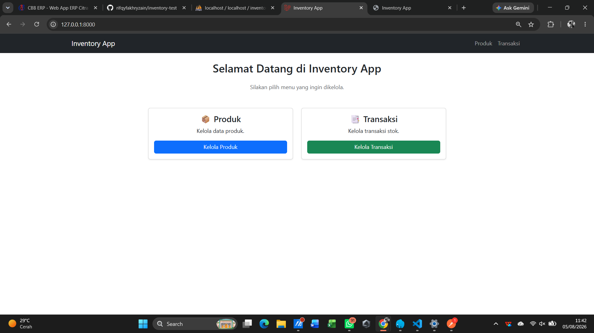
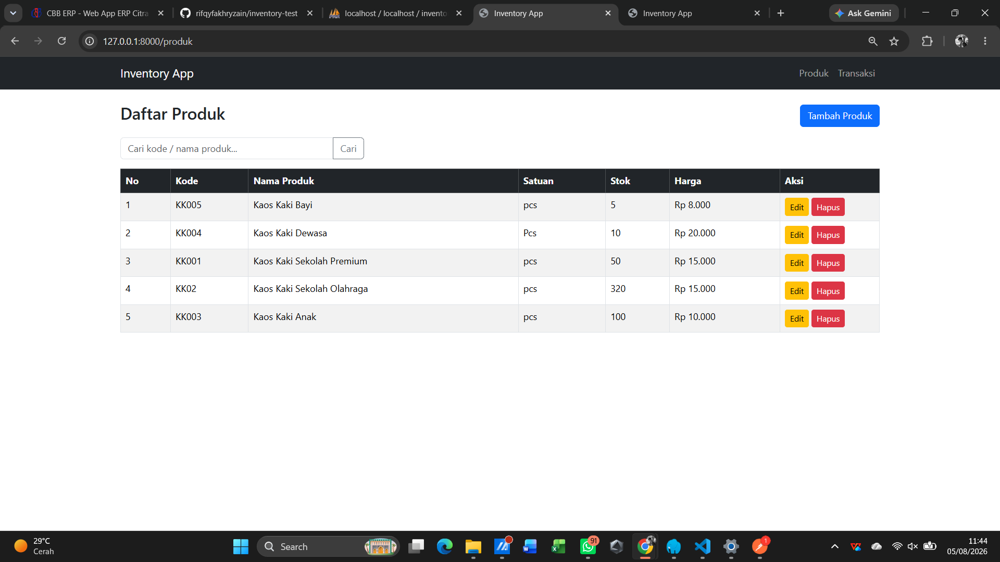
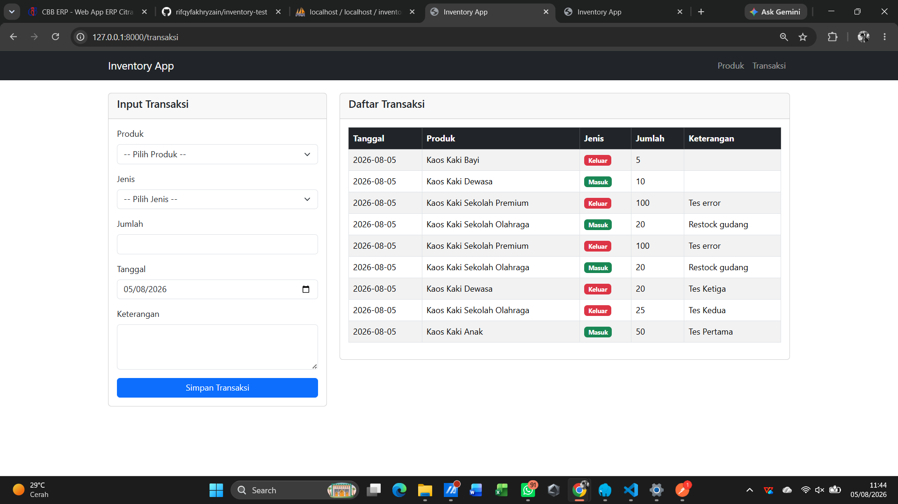

# 📦 Inventory App

Aplikasi **Inventory Management** sederhana yang dibangun menggunakan **Laravel 10** sebagai mini project. Aplikasi ini menyediakan fitur pengelolaan produk, transaksi stok masuk/keluar, serta REST API untuk integrasi dengan aplikasi lain.

---

## ✨ Fitur

### Web

- Dashboard
- CRUD Produk
- Pencarian Produk
- Transaksi Stok Masuk
- Transaksi Stok Keluar
- Validasi stok keluar
- Update stok otomatis
- Riwayat transaksi

### REST API

#### Produk

| Method | Endpoint           |
| ------ | ------------------ |
| GET    | `/api/produk`      |
| GET    | `/api/produk/{id}` |
| POST   | `/api/produk`      |
| PUT    | `/api/produk/{id}` |
| DELETE | `/api/produk/{id}` |

#### Transaksi

| Method | Endpoint         |
| ------ | ---------------- |
| GET    | `/api/transaksi` |
| POST   | `/api/transaksi` |

---

## 🛠️ Teknologi

- Laravel 10
- PHP 8.3
- MySQL
- Bootstrap 5
- REST API
- Postman (API Testing)

---

## 🚀 Instalasi

### Clone repository

```bash
git clone https://github.com/rifqyfakhryzain/inventory-test.git
```

Masuk ke folder project

```bash
cd inventory-test
```

Install dependency

```bash
composer install
```

Copy file environment

```bash
cp .env.example .env
```

Generate application key

```bash
php artisan key:generate
```

Konfigurasi database pada file **.env**

Kemudian jalankan migrasi dan seeder

```bash
php artisan migrate --seed
```

Menjalankan aplikasi

```bash
php artisan serve
```

Aplikasi dapat diakses melalui

```
http://127.0.0.1:8000
```

---

## 📁 Struktur Folder

```
app/
└── Http/
    └── Controllers/
        ├── Api/
        ├── ProductController.php
        └── TransactionController.php

resources/
└── views/
    ├── dashboard.blade.php
    ├── produk/
    └── transaksi/

routes/
├── web.php
└── api.php
```

---

# 📸 Screenshot

## Dashboard

Halaman utama aplikasi.



---

## Daftar Produk

Menampilkan seluruh data produk beserta fitur pencarian.



---

## Tambah Produk

Form untuk menambahkan data produk baru.


---

## Edit Produk

Form untuk memperbarui data produk.


---

## Transaksi

Halaman transaksi stok masuk dan stok keluar beserta riwayat transaksi.



---

## 📌 REST API Testing

Seluruh endpoint REST API telah diuji menggunakan **Postman**.

---

## 📌 REST API Testing

| Dokumentasi              | Link                                                                                            |
| ------------------------ | ----------------------------------------------------------------------------------------------- |
| 📖 Postman Documentation | https://documenter.getpostman.com/view/50481330/2sBY4VHwWo#ce99bcac-aa55-48fe-8a6c-c5d4e456611d |

---

## 👨‍💻 Author

**Rifqy Fakhry Zain**
